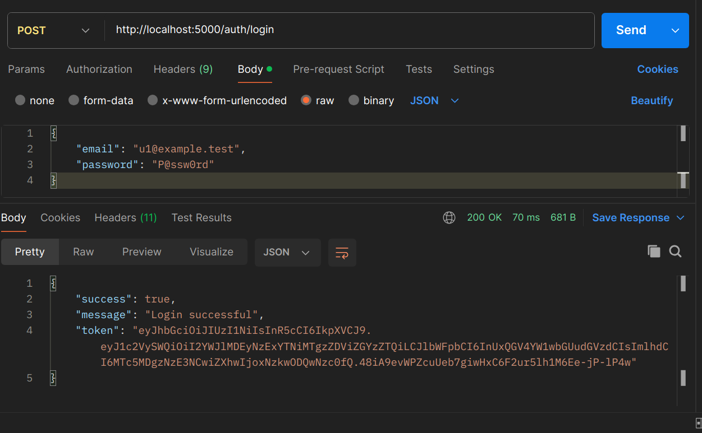
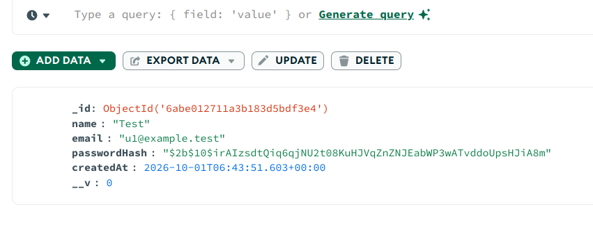
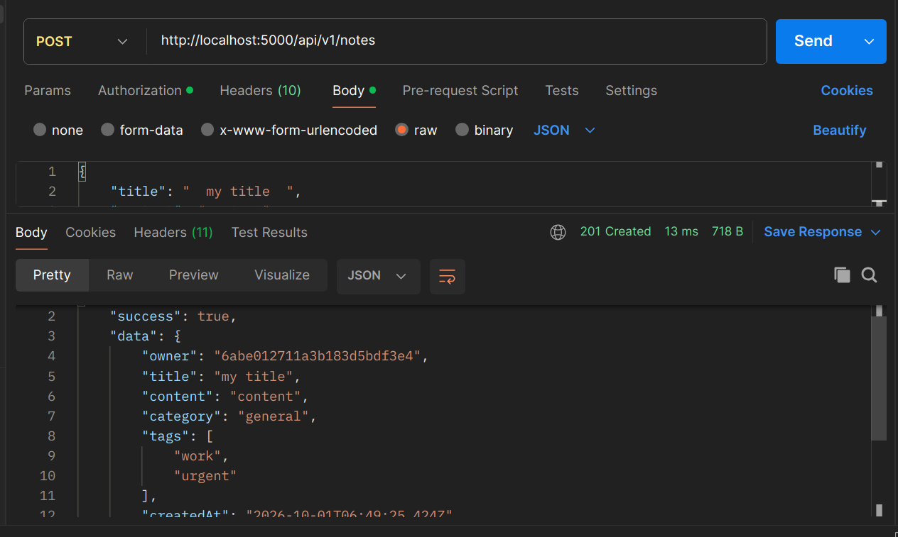
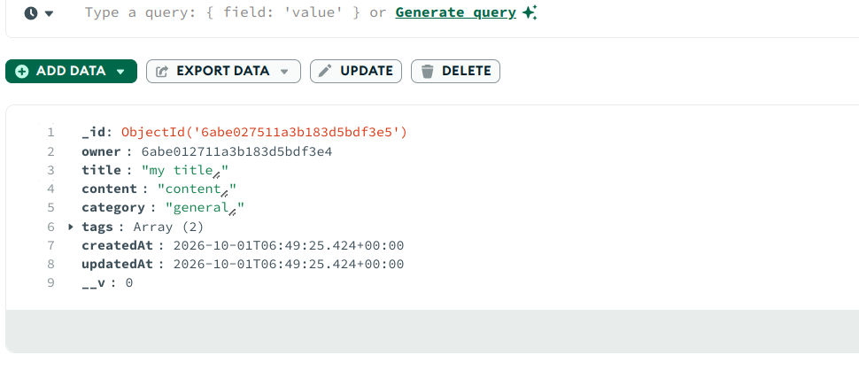
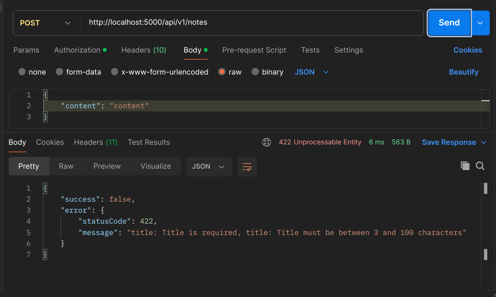
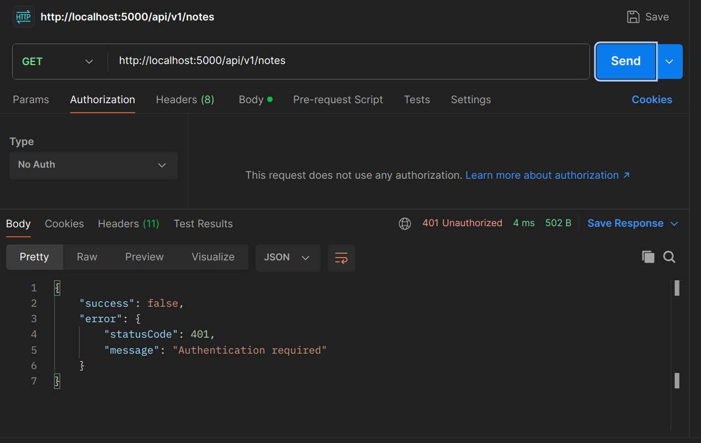

# Replace in-memory storage with MongoDB (Mongoose)

## Requirements
- Use MongoDB via Mongoose (no in-memory fallbacks)
- `User` schema: `email` (unique), `passwordHash`, `createdAt`
- `Note` schema: `title`, `content`, `tags` (array), `owner` (ObjectId ref `User`), `createdAt`, `updatedAt` (timestamps)
- Add validation at the schema level
- Add a `pre('save')` hook that trims the `title`
- Ensure users can only see their own notes (queries filter by `owner`)

 
 

 
 

## Verification steps (concise)
1. Start MongoDB and the app (`MONGODB_URI` in `.env`).
2. Register user A, login → token A.
3. Create note with `title` containing surrounding spaces using token A. Verify saved `title` is trimmed and timestamps exist.
4. Register user B, login → token B. GET the note created by A using token B → expect `404`.
5. Attempt to create a note without `title` or `content` → expect validation error (4xx).

