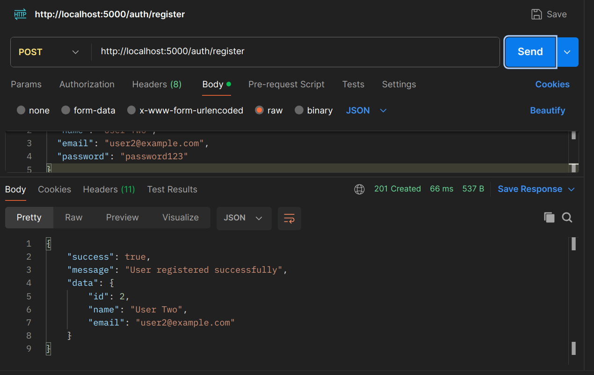
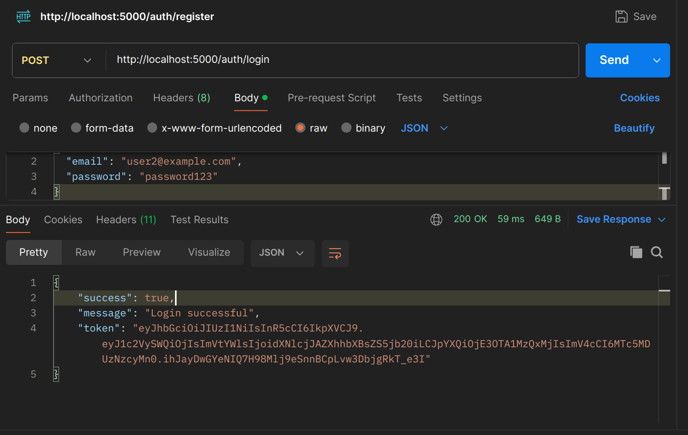
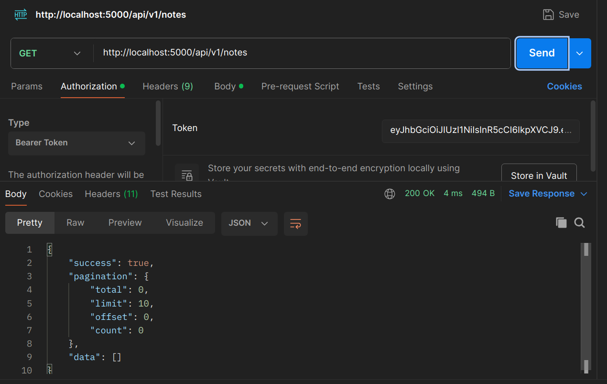
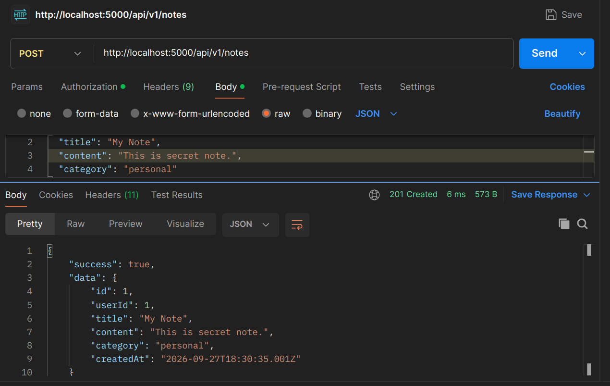
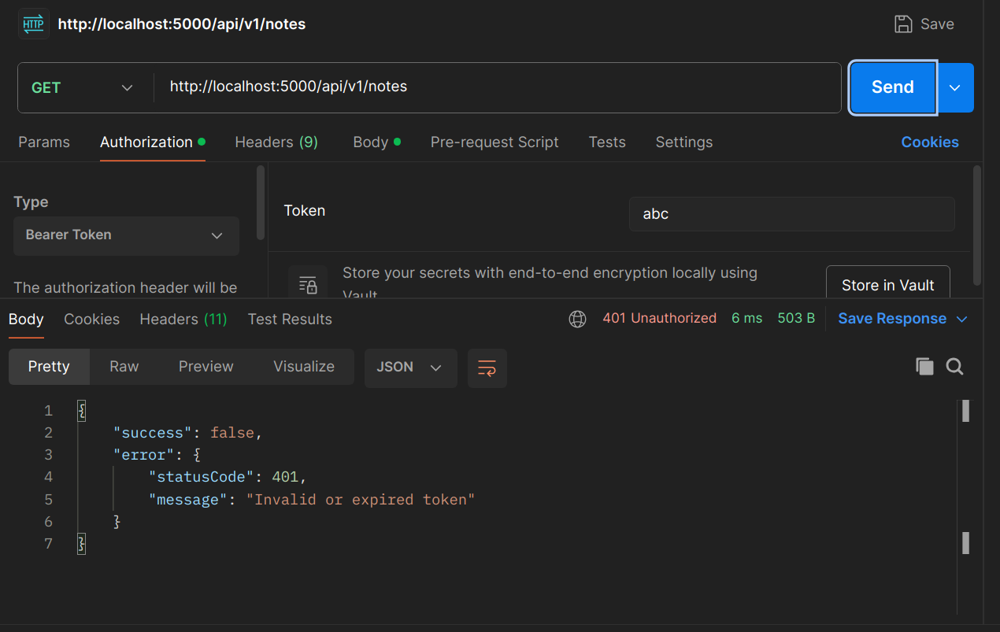

# Notes REST API — JWT Authentication

A RESTful Notes API built with **Node.js and Express**, featuring JWT authentication and user-specific note ownership.

## Features

* User registration with bcrypt password hashing
* JWT-based login authentication
* Protected Notes API using `requireAuth`
* Users can only access their own notes
* Input validation with `express-validator`
* Centralized error handling with `AppError`
* Pagination, filtering, searching, and sorting
* CORS and rate limiting
* API versioning with `/api/v1`

## Approach

1. **Register** → Validate user → Hash password → Store user.
2. **Login** → Verify credentials → Generate JWT.
3. **Authenticate** → `requireAuth` verifies the JWT and adds user information to `req.user`.
4. **Authorize** → Each note contains `userId`; controllers verify ownership before allowing access.
5. **Error Handling** → Authentication and application errors are handled centrally with appropriate HTTP status codes.

## Authentication Flow

```text
Register
   ↓
Hash Password
   ↓
Create User
   ↓
Login
   ↓
Verify Password
   ↓
Generate JWT
   ↓
Bearer Token
   ↓
requireAuth
   ↓
Verify JWT
   ↓
req.user
   ↓
Check note.userId
   ↓
Allow / Deny
```

## API Endpoints

| Method | Endpoint            | Authentication |
| ------ | ------------------- | -------------- |
| POST   | `/auth/register`    | ❌              |
| POST   | `/auth/login`       | ❌              |
| GET    | `/api/v1/notes`     | ✅              |
| GET    | `/api/v1/notes/:id` | ✅              |
| POST   | `/api/v1/notes`     | ✅              |
| PUT    | `/api/v1/notes/:id` | ✅              |
| DELETE | `/api/v1/notes/:id` | ✅              |

## Setup

```bash
npm install
npm start
```

Create `.env`:

```env
PORT=5000
JWT_SECRET=my_super_secret_key
JWT_EXPIRES_IN=1h
```

For protected requests:

```http
Authorization: Bearer <JWT_TOKEN>
```

---

## Testing

The API was tested using Postman.

### 1. User Registration

A new user can register using:

```http
POST /auth/register
```

The password is hashed before storing the user.

**Screenshot:**

`u2-register.png`



---

### 2. User Login

A registered user can log in using:

```http
POST /auth/login
```

A JWT token is returned after successful authentication.

**Screenshot:**

`u2-login.png`



---

### 3. Access Protected Notes

The JWT is sent using the **Bearer Token** authorization method.

```http
GET /api/v1/notes
Authorization: Bearer <JWT>
```

**Screenshot:**

`u2-accessing.png`



---

### 4. Create Authenticated Note

An authenticated user can create a note:

```http
POST /api/v1/notes
```

The API automatically associates the note with the authenticated user's ID.

Example:

```json
{
  "id": 1,
  "userId": 1,
  "title": "My Note",
  "content": "This is secret note.",
  "category": "personal"
}
```

**Screenshot:**

`create-note.png`



---

### 5. Authentication Required

Trying to access the Notes API without authentication returns:

```text
401 Unauthorized
```

**Screenshot:**

`no-auth-access.png`


---

### 6. Invalid Token

An invalid JWT is rejected by the `requireAuth` middleware.

```text
401 Unauthorized
Invalid or expired token
```

**Screenshot:**

`invalid-token.png`



---

### 7. User-Specific Access

A second user can register and log in, but cannot access notes belonging to another user.

The API verifies:

```js
note.userId === req.user.userId
```

This ensures that users can only read or modify their own notes.


---

## Project Structure

```text
notes-api/
├── src/
│   ├── controllers/
│   │   ├── authController.js
│   │   └── noteController.js
│   ├── data/
│   │   ├── notes.js
│   │   └── users.js
│   ├── errors/
│   │   └── AppError.js
│   ├── middleware/
│   │   ├── errorHandler.js
│   │   ├── logger.js
│   │   ├── notFound.js
│   │   ├── requireAuth.js
│   │   └── validate.js
│   ├── routes/
│   │   ├── authRoutes.js
│   │   └── noteRoutes.js
│   ├── validators/
│   │   ├── authValidator.js
│   │   └── noteValidator.js
│   ├── app.js
│   └── server.js
├── screenshots/
│   ├── u2-register.png
│   ├── u2-login.png
│   ├── u2-accessing.png
│   ├── invalid-token.png
│   ├── no-auth-access.png
│   └── create-note.png
├── .env
├── .gitignore
├── package.json
└── README.md
```

## Note

This project currently uses **in-memory storage** for users and notes. Data will be reset whenever the server restarts. A database such as MongoDB or PostgreSQL can be added later without changing the authentication flow significantly.
