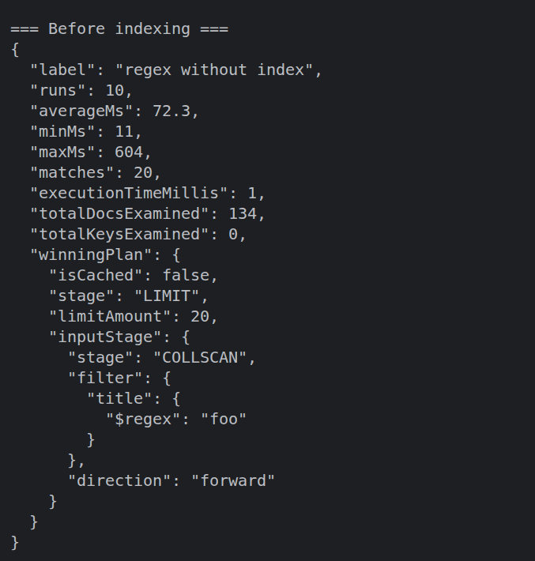
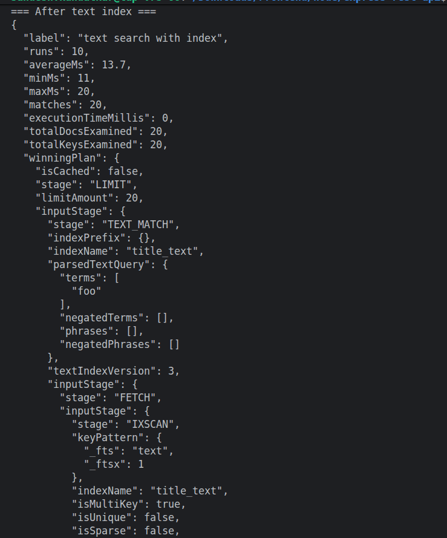
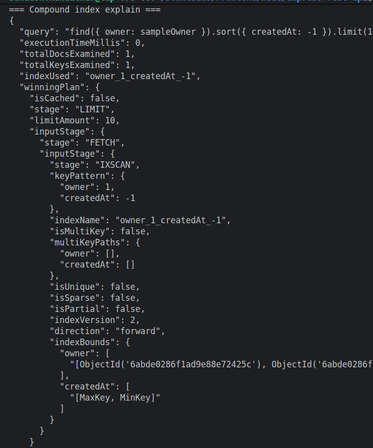

# Notes Index Report

## Data setup
- Database: configured via `.env` (uses Atlas or local fallback)
- Collection: `notes` (Mongoose model `Note`)
- Fake data: 10,000 generated notes via `@faker-js/faker`
- Title distribution: every 7th generated note contains the token `foo` (selective match)
- Benchmark runs: 10 iterations per query (average/min/max reported)

## Commands run
Run the prepared benchmark script which performs the full sequence:

```bash
cd /home/sandesh.kandalkar/Downloads/Frontend/node/express-rest-api
node scripts/load-test-notes.js
```

The script performs:
- wipe `notes` collection
- insert ~10,000 fake notes
- run `find({ title: /foo/ })` baseline (no index) measured over 10 runs
- create text index on `title` and run `$text` search measured over 10 runs
- create compound index `{ owner: 1, createdAt: -1 }` and `explain()` the recent-notes query


## 1) Before indexing (regex scan)
Output:

 

Evidence: `COLLSCAN` indicates a full collection scan; `totalDocsExamined` is non-trivial and average time is higher.


## 2) After text index (`$text` search)
Output:

 

Evidence: `TEXT_MATCH` + `indexName: "title_text"` and much lower `averageMs` and `totalDocsExamined`.


## 3) Compound index explain (recent notes query)
Output:


Evidence: `IXSCAN` and `indexName: "owner_1_createdAt_-1"` confirm the compound index is used for the common "my recent notes" query.


## Repro steps
1. Ensure Mongo is reachable (Atlas set in `.env`).
2. Install deps:

```bash
npm install
```

3. Run the benchmark:

```bash
node scripts/load-test-notes.js
```

## Conclusion
- The benchmark demonstrates a clear performance improvement when using a text index for title searches versus an unindexed regex scan.
- The compound index `{ owner: 1, createdAt: -1 }` is used by the "my recent notes" query as expected.


---
