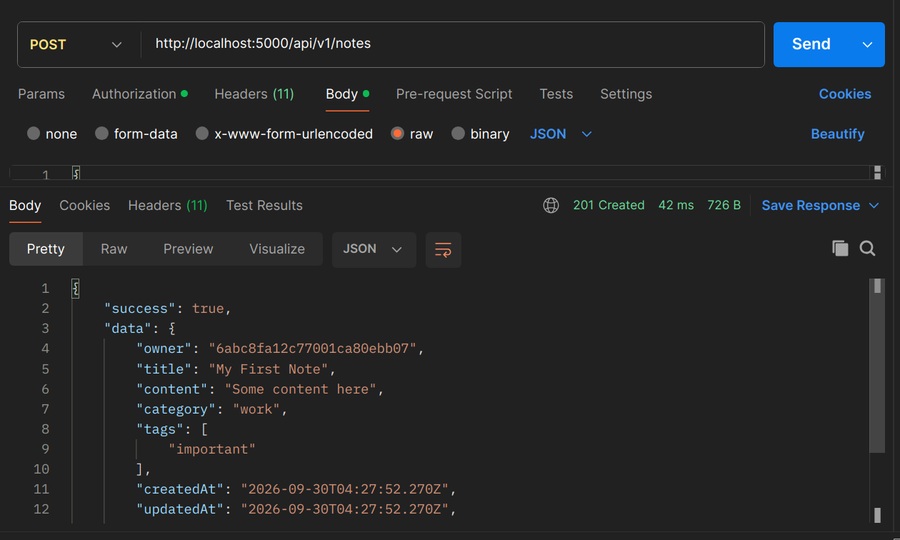
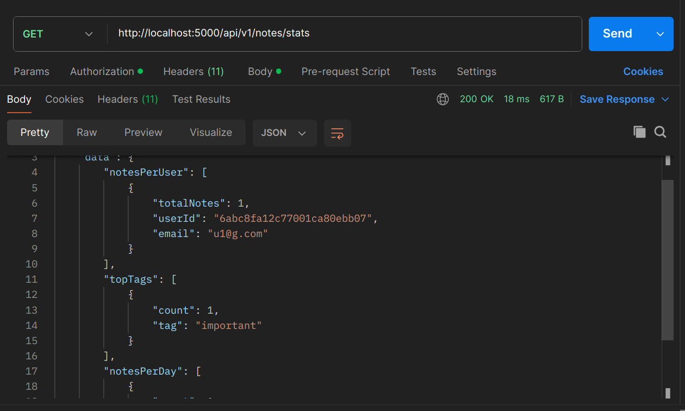

# Notes API — `/notes/stats` Requirement

## Objective

Added a `GET /notes/stats` endpoint to the integrated Notes API.

The endpoint returns:

1. Total notes per user
2. Top 10 most-used tags
3. Notes created per day for the last 7 days

The statistics are generated using a **single MongoDB aggregation pipeline**, using `$facet` to calculate the three results together.

---

## 1. Create a Note

Before testing the statistics endpoint, a note was created successfully through:

```text
POST /api/v1/notes
```

### Result

```text
201 Created
```

The response shows the note was created with:

- Owner
- Title
- Content
- Category
- Tags
- `createdAt`
- `updatedAt`

### Screenshot  



---

## 2. Test `/notes/stats`

### Request

```text
GET http://localhost:5000/api/v1/notes/stats
```

The request includes the required authentication.

### Result

```text
200 OK
```

The endpoint successfully returned the statistics response.

### Screenshot



---

## 3. Total Notes Per User

The response contains a `notesPerUser` section showing the number of notes owned by each user.

Example:

```json
{
  "totalNotes": 1,
  "userId": "...",
  "email": "u1@g.com"
}
```

### Requirement achieved

- Total notes per user: **Yes**

---

## 4. Most-Used Tags

The response contains a `topTags` section.

Example:

```json
{
  "count": 1,
  "tag": "important"
}
```

The aggregation counts tag usage and returns the top 10 most-used tags.

### Requirement achieved

- Most-used tags overall (top 10): **Yes**

---

## 5. Notes Created Per Day

The response also contains a `notesPerDay` section.

Example:

```json
{
  "date": "...",
  "count": 0
}
```

This shows how many notes were created on each day during the last 7 days.

Days with no notes are returned with a count of `0`.

### Requirement achieved

- Notes created per day for the last 7 days: **Yes**


---

## 6. Single Aggregation Pipeline

The endpoint uses MongoDB's `$facet` stage so the three statistics are calculated as branches of one aggregation pipeline.

```text
                    Notes Collection
                           |
                         $facet
                    _______|_______
                   /       |       \
                  /        |        \
        Notes/User      Top Tags   Notes/Day
```

This avoids making three separate aggregation calls.

### Requirement achieved

- Single aggregation pipeline where possible: **Yes**

---

## 7. Final Verification

The Postman request returned:

```text
GET /api/v1/notes/stats
200 OK
```

The response includes:

```text
✓ Total notes per user
✓ Top 10 most-used tags
✓ Notes created per day for the last 7 days
✓ Authentication
✓ Single aggregation pipeline using $facet
```

### Final Screenshot


---

# Conclusion

The `/notes/stats` endpoint has been successfully added and tested using Postman.

It provides the required note statistics through one MongoDB aggregation pipeline and returns the results in a structured JSON response.
